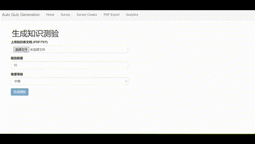

# Auto Quiz——根据知识库生成测验

这是一个自动生成测验题目的工具，可以根据上传的知识库文档（PDF/TXT）自动生成测验，并提供测验结果分析。

## 功能特性

-   **自动生成测验**: 上传PDF或TXT格式的知识库文档，即可自动生成选择题。
-   **可定制的测验**: 可以设置题目数量和难度等级。
-   **测验结果分析**: 测验完成后，可以查看错题和正确答案，并分析知识点掌握情况。

## 演示

以下是一个演示文件，展示了如何使用该工具生成测验、进行测验并分析结果：



## 使用方法

1.  **上传知识库文档**: 在首页上传PDF或TXT格式的知识库文档。
2.  **设置测验参数**: 设置题目数量和难度等级。
3.  **生成测验**: 点击“生成测验”按钮。
4.  **开始测验**: 点击导航栏的“Survey”链接开始测验。
5.  **查看结果分析**: 测验完成后，会自动跳转到分析页面，显示测验结果和知识点分析。

## 技术栈

-   **前端**: React
-   **后端**: Flask (Python)
-   **AI模型**: Gemini API


## 启动项目

1.  确保已安装 Node.js 和 Python。
2.  在 `backend` 目录下安装 Python 依赖：

    ```bash
    pip install -r requirements.txt
    ```

3.  在 frontend 目录下安装 JavaScript 依赖：

    ```bash
    npm install
    ```

4.  运行 start.sh 脚本启动前后端服务：

    ```bash
    ./start.sh
    ```

5.  在浏览器中打开 `http://localhost:3000` 访问应用。

## 注意事项

-   请确保已配置 Gemini API 密钥，并将其添加到 .env 文件中。
-   如果遇到网络问题，请检查代理设置。
